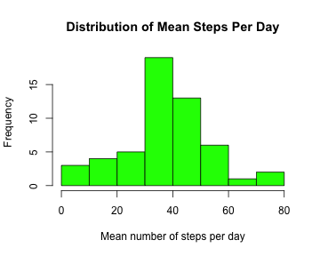
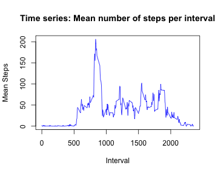
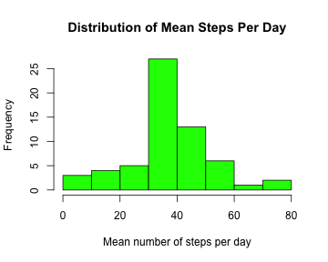
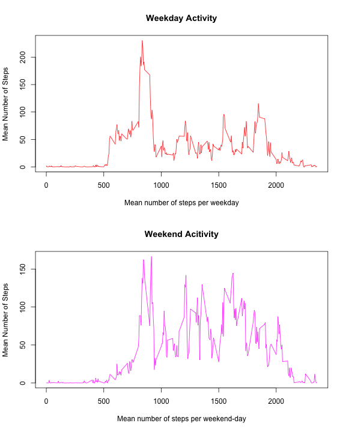

## Loading and preprocessing the data

First, the data is loaded with the read.csv(). The header (first ten lines) are examined to ensure that the data was loaded properly and looks as expected.


```r
activity=read.csv('activity.csv')
head(activity)
```

```
##   steps       date interval
## 1    NA 2012-10-01        0
## 2    NA 2012-10-01        5
## 3    NA 2012-10-01       10
## 4    NA 2012-10-01       15
## 5    NA 2012-10-01       20
## 6    NA 2012-10-01       25
```

We will do any processing of the data in the following steps for specific tasks as necessary.  
<br /><br />


## What is mean total number of steps taken per day?

Now, we find the mean number of steps taken on each day and examine the distribution by using a histogram.


```r
datemeans=tapply(activity$steps,activity$date,mean,na.rm=TRUE)
hist(datemeans,col="green",xlab="Mean number of steps per day", ylab="Frequency",main="Distribution of Mean Steps Per Day")
```

 

We can look at the mean and median of the overall distribution of steps per day:

```r
paste ("Mean of total number of steps per day = ",round((mean(datemeans,na.rm=TRUE)),3))
```

```
## [1] "Mean of total number of steps per day =  37.383"
```

```r
paste ("Median of total number of steps per day = ",round((median(datemeans,na.rm=TRUE)),3))
```

```
## [1] "Median of total number of steps per day =  37.378"
```
<br /><br />


## What is the average daily activity pattern?

By comparing the number of steps in the same time interval from day to day, we can get an idea of which times of the day, on average, the subject is more or less active.


```r
intervalmeans=tapply(activity$steps,activity$interval,mean,na.rm=TRUE)
intervals=unique(unlist(activity$interval))
plot(intervals,intervalmeans,type='l',col='blue',xlab="Interval",ylab="Mean Steps",main="Time series: Mean number of steps per interval")
```

 

The peak of this time-series average is at the interval 835, which is the 5-minute interval, on average across all the days in the dataset, that contains the maximum number of steps.


```r
intervals[intervalmeans==max(intervalmeans,na.rm=TRUE)]
```

```
## [1] 835
```
<br /><br />


## Imputing missing values

First, we want to determine how many missing values exist in the dataset:

```r
sum(is.na(activity$steps))
```

```
## [1] 2304
```


Next, we want to fill in these missing values with reasonable values using a logical strategy. Here we employ a technique to fill in the missing data with the mean of that particular 5-minute interval average using the entire dataset. We use this to create a new dataset that is equal to the original dataset, except with the missing data filled in where there were previously "NA"s.


```r
newfile=activity
missing=is.na(newfile$steps)
for(i in 1:length(newfile$steps)){
  if(missing[[i]]==TRUE){
    newfile$steps[[i]]=intervalmeans[as.numeric(names(intervalmeans))==newfile$interval[[i]]]
  }
}
head(newfile)
```

```
##     steps       date interval
## 1 1.71698 2012-10-01        0
## 2 0.33962 2012-10-01        5
## 3 0.13208 2012-10-01       10
## 4 0.15094 2012-10-01       15
## 5 0.07547 2012-10-01       20
## 6 2.09434 2012-10-01       25
```
Note that now in the first ten lines we have the average number of steps in the intervals replacing what used to be NA values (see initial header at beginning of file for comparison).

Now we make a histogram of the total number of steps taken each day, similar to the previous histogram, except including the imputed data. 


```r
datemeans_new=tapply(newfile$steps,newfile$date,mean)
hist(datemeans_new,col="green",xlab="Mean number of steps per day", ylab="Frequency",main="Distribution of Mean Steps Per Day")
```

 

Below we give the mean and median total number of steps taken per day.


```r
paste ("Mean of total number of steps per day = ",round((mean(datemeans_new)),3))
```

```
## [1] "Mean of total number of steps per day =  37.383"
```

```r
paste ("Median of total number of steps per day = ",round((median(datemeans_new)),3))
```

```
## [1] "Median of total number of steps per day =  37.383"
```

Do these values differ from the estimates from the first part of the assignment? What is the impact of imputing missing data on the estimates of the total daily number of steps?


<br /><br />


## Are there differences in activity patterns between weekdays and weekends?

After using "strptime" to convert the "date" column into a readable date for R, we determine the day of the week of each date with the weekdays() function. Then we create a new column (newfile$dayofweek) in the new datatable with the imputed values (newfile) that is a factor variable flagging whether it is a "weekday" or "weekend".


```r
times=strptime(newfile$date,format="%Y-%m-%d")
newfile$daynames=weekdays(times)
newfile$dayofweek=ifelse(newfile$daynames %in% c("Saturday","Sunday"),"weekend", "weekday")
```


As before we construct a time-series plot, but now we split based on the factor variable "dayofweek" to compare the weekday time-series number steps to that of the weekend.


```r
weekdaymean=tapply(newfile$steps[newfile$dayofweek=="weekday"],newfile$interval[newfile$dayofweek=="weekday"],mean)
weekendmean=tapply(newfile$steps[newfile$dayofweek=="weekend"],newfile$interval[newfile$dayofweek=="weekend"],mean)

par(mfrow=c(2,1))
plot(intervals,weekdaymean, xlab="Mean number of steps per weekday", ylab="Mean Number of Steps",main="Weekday Activity",type="l",col="red")
plot(intervals,weekendmean, xlab="Mean number of steps per weekend-day", ylab="Mean Number of Steps", main="Weekend Acitivity",type="l",col="magenta")
```

 

It looks as though, on average, weekend days involve more steps through the middlemost intervals than weekdays do.

<br /><br />

